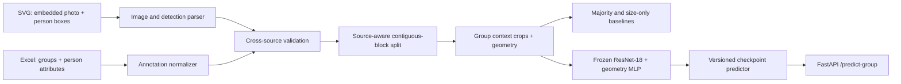
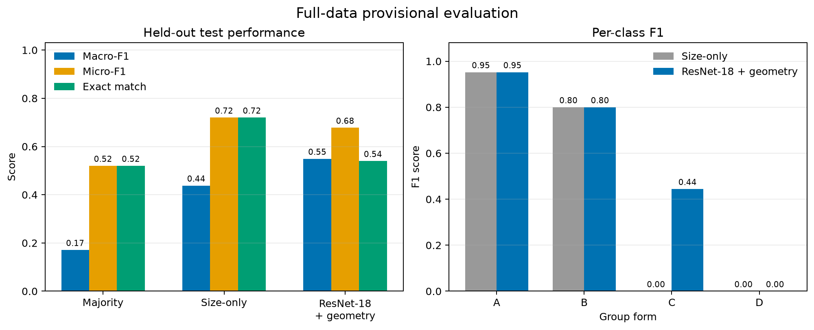
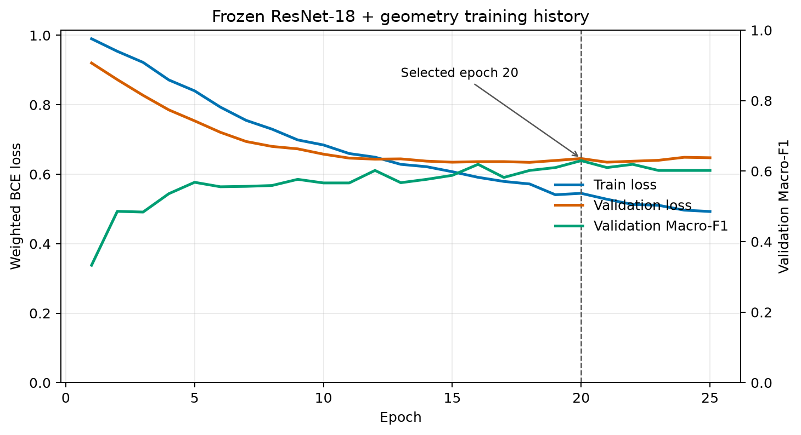

# Conference Social Sensing

An end-to-end computer-vision MLE project for predicting small-group interaction
forms in conference photos. The repository turns detector-authored SVG files and
sparse human annotations into validated training data, compares interpretable
baselines with a visual model, and serves reproducible predictions through
FastAPI.

> **MVP status:** complete. Results use all 300 source photos. The split remains
> provisional because contiguous photo blocks are used as a conservative proxy
> for unavailable event/session scene IDs.

## Problem

Given an already-proposed interaction group, predict one or more social forms:

- **A:** circular group of three or more people
- **B:** face-to-face dyad
- **C:** side-by-side interaction
- **D:** shared gaze or shared point of attention

The source annotations are sparse: only confirmed interaction-group members are
coded. People detected elsewhere in a photo are therefore **unknown**, not
negative examples. Preserving this distinction is the central data-design
decision in the project.

## System architecture



## Dataset snapshot

| Item | Count |
|---|---:|
| Conference sources | 2 |
| Photos | 300 |
| Person detections | 1,721 |
| Photos with group annotations | 289 |
| Interaction groups | 346 |
| Annotated group members | 819 |
| Uncoded detections retained as unknown | 902 |
| Validation errors | 0 |

The full label distribution is A: 88, B: 181, C: 51, and D: 26. Both supplied
workbooks currently contain single-form rows only, but the parser, schema, loss,
metrics, predictor, and API all support multi-label targets.

### Leakage-aware split

ASSA and CLEO are split independently so conference identity cannot become a
train/test shortcut. Neighboring IDs are kept in unsplittable 10-photo blocks.

| Source | Train photos | Validation photos | Test photos |
|---|---:|---:|---:|
| ASSA Week1 | 110 | 20 | 20 |
| CLEO Week2 | 110 | 20 | 20 |
| **Total** | **220** | **40** | **40** |

The resulting group counts are 252 train, 44 validation, and 50 test.

## Modeling

Each group crop is the union of its member boxes plus a 20% context margin,
resized with aspect-ratio-preserving padding. The model combines:

1. a 512-dimensional ImageNet-pretrained ResNet-18 feature, L2-normalized before
   fusion;
2. group size and 11 normalized geometry features, standardized using training
   statistics only;
3. a 67,716-parameter MLP head trained with class-weighted binary cross-entropy.

The backbone stays frozen to control overfitting on 252 training groups. Model
selection uses validation Macro-F1 with early stopping; epoch 20 was selected.

## Results

| Model | Test Macro-F1 | Test Micro-F1 | Exact match |
|---|---:|---:|---:|
| Majority combination | 0.171 | 0.520 | 0.520 |
| Group size only | 0.438 | **0.720** | **0.720** |
| **ResNet-18 + geometry** | **0.549** | 0.678 | 0.540 |



The visual model improves the primary Macro-F1 by 11.1 points over size-only and
learns class C, which the size baseline never predicts. Its lower exact-match
score is an expected tradeoff from class weighting: the model recalls minority
labels more aggressively and produces more false positives.

| Group form | Size-only F1 | Visual + geometry F1 |
|---|---:|---:|
| A | 0.952 | 0.952 |
| B | 0.800 | 0.800 |
| C | 0.000 | 0.444 |
| D | 0.000 | 0.000 |



### Error analysis

Class D remains unresolved. It has only 17 training examples, 2 validation
examples, and 7 test examples. The selected model predicts seven D positives in
the test split, but none matches a coded D group. Shared gaze is also visually
subtle and may require face orientation or a wider scene crop. This is reported
as a limitation rather than tuned against the test set.

## Data availability

The conference photos, detector SVGs, and annotation workbooks are excluded from
this repository because they contain identifiable people and are not licensed
for redistribution. `configs/data.example.json` documents the expected local
layout. Copy it to the ignored `configs/data.json` file and update the paths for
your local data.

## Reproduce the pipeline

Requires Python 3.10+ (Python 3.12 recommended) and the two local source batches declared in
`configs/data.json`.

```bash
python3.12 -m venv .venv
.venv/bin/pip install -r requirements.txt
cp configs/data.example.json configs/data.json
# Edit configs/data.json to point to local SVG directories and workbooks.

make dataset     # SVG/Excel -> validated tables, split, and group crops
make baselines   # majority and size-only evaluations
make train       # frozen ResNet-18 + geometry
make figures     # regenerate README charts from experiment artifacts
make test        # full unit and real-data integration suite
```

Generated images, normalized tables, predictions, and checkpoints are ignored by
Git because they contain source data or reproducible artifacts.

## Serve predictions

```bash
make serve
```

Open `http://127.0.0.1:8000/docs` for interactive documentation.

- `GET /health` reports model readiness, device, and output labels.
- `POST /predict-group` accepts one group crop, a normalized geometry JSON
  object, and an optional threshold.
- Uploads are type-checked and limited to 10 MB.

The serving path reuses `GroupFormPredictor`, the same checkpoint-loading,
preprocessing, standardization, and thresholding implementation used for offline
inference.

## Repository layout

```text
configs/                         Data, split, crop, baseline, and model configs
src/conference_social_sensing/
  data/                          SVG parsing, normalization, validation, splitting
  baselines/                     Majority/size-only models and multi-label metrics
  modeling/                      Dataset, ResNet fusion model, training, inference
  api/                           FastAPI application and local server
scripts/                         Reproducible report figures
tests/                           Unit, API, checkpoint, and real-data integration tests
```

## Scope and limitations

- The API begins with an already-proposed group; automatic person detection and
  group proposal are not part of this MVP.
- Contiguous blocks reduce adjacent-photo leakage but are not substitutes for
  true event/session scene IDs.
- No supplied annotation currently contains a real multi-label combination.
- Demographic columns are normalized for future aggregate research but are not
  modeled in this MVP. They describe annotator-perceived attributes, not
  self-identified demographics.
- D performance is constrained by sample scarcity and label ambiguity.

## Future work

1. Replace proxy blocks with verified session/scene IDs.
2. Compare frozen DINOv2 or CLIP features against ResNet-18.
3. Add face orientation or a wider-context branch for shared-gaze detection.
4. Explore pseudo-labeling only after a stronger supervised teacher is available.
